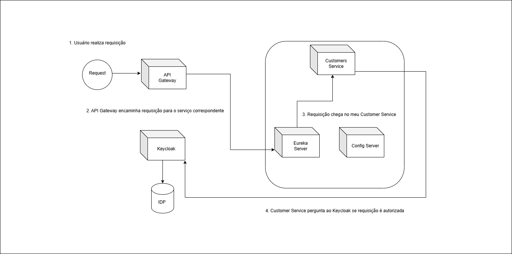

## Arquitetura da Aplicação

1. Config Server usado para centralizar as configurações dos serviços.
2. Eureka Server para permitir a descoberta de serviços.
3. API Gateway como porta de entrada da aplicação.
4. Keycloak como Authorization Server da aplicação.

## Fluxo da Aplicação

Esse é um fluxo bastante comum, mas possui algumas desvantagens, pois caso eu possua muitos microservices, meu
Authorization
Server pode ficar sobrecarregado.

A Grant Type utilizada foi o Authorization Code.

## Termos Comuns OAuth2.0

1. Client: Pode-se entender como uma aplicação que realiza o acesso a outra aplicação em nome de outra entidade (
   Resource
   Owner), neste caso, meu API Gateway.
2. Resource Owner: É o dono do recurso, que pode ser tanto uma aplicação terceira, como um usuário final.
3. Protected Resource: É o recurso protegido em si, que normalmente é algum endpoint, no caso desta aplicação, o meu
   /api/v1/customers .
4. Resource Server: Onde o recurso protegido está localizado, neste caso, o Customers Service.
5. Authorization Server: Responsável pela emissão e validação de tokens de acesso.
6. Grant Type: Fluxos do OAuth2.0 para autorização, podendo ser eles o Implicit, o Client Credentials, o Authorization Code e o
   Resource Owner Password Credentials.